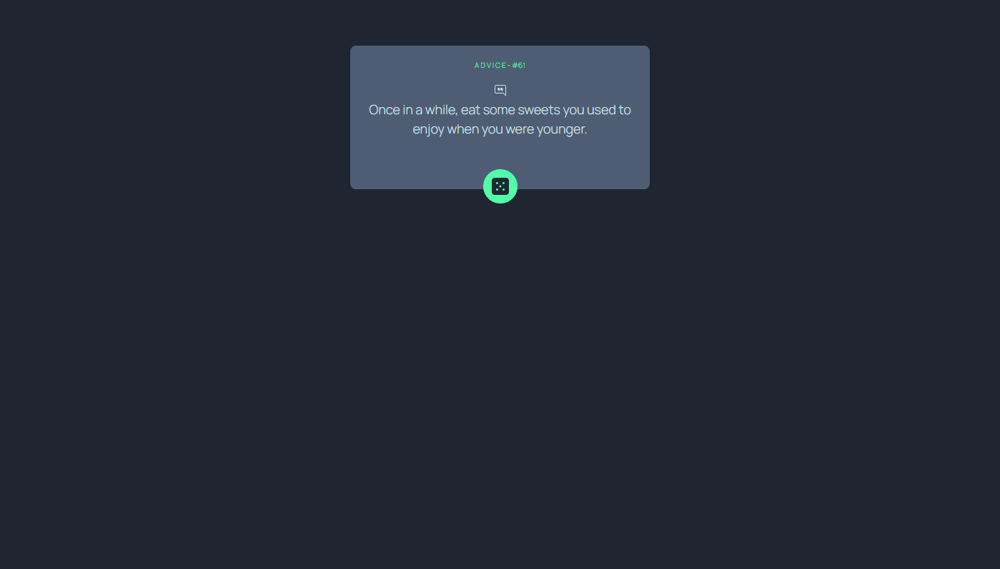
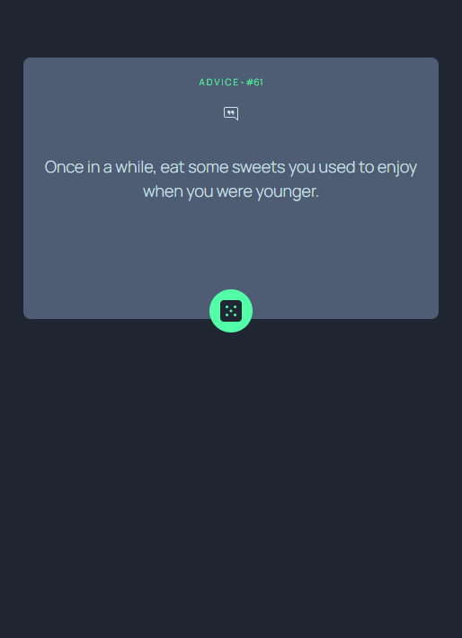

# Frontend Mentor - Advice generator app solution

This is a solution to the [Advice generator app challenge on Frontend Mentor](https://www.frontendmentor.io/challenges/advice-generator-app-QdUG-13db). Frontend Mentor challenges help you improve your coding skills by building realistic projects.

## Table of contents

- [Overview](#overview)
  - [The challenge](#the-challenge)
  - [Screenshot](#screenshot)
- [My process](#my-process)
  - [Built with](#built-with)
- [Author](#author)
## Overview

### The challenge
Create an advice page using the [Advice Slip API](https://api.adviceslip.com) to generate random advices.

### Screenshot

Desktop behavior

Mobile behavior

## My process

### Built with

- Flexbox
- [TailwindCSS] (https://tailwindcss.com/docs/installation)
- [React](https://reactjs.org/) - JS library

## Author
- Website - [Beatriz Neaime](beatrizneaime.vercel.app)
- Frontend Mentor - [@BeatrizNeaime](https://www.frontendmentor.io/profile/BeatrizNeaime)
- Linkedin - [Beatriz Neaime](https://www.linkedin.com/in/beatriz-neaime-1564b51b1/)

